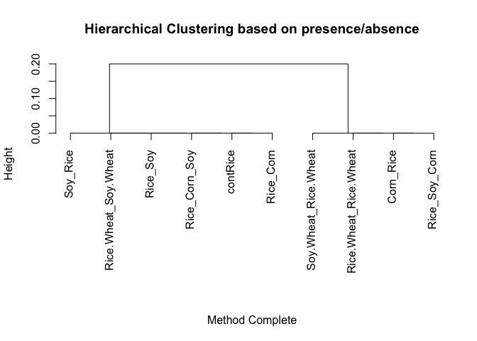
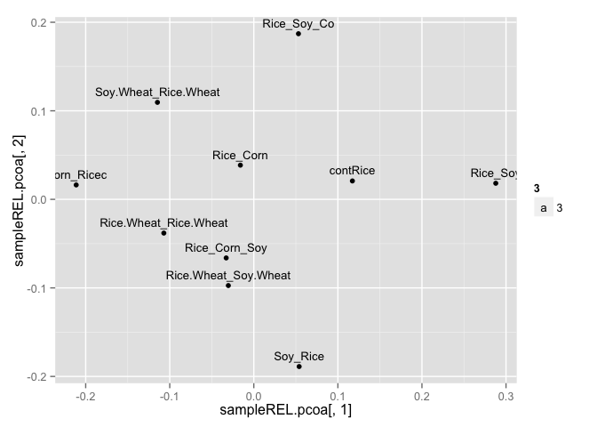

# 10-year rotation study Arkansas
Alejandro Rojas  
January 30, 2015  


Read the data into R for multivariate analysis using a text file that is tab-delimited:

|                | contRice | Corn_Ricec | Rice_Corn | Rice_Corn_Soy | Rice_Soy | Rice_Soy_Co | Rice.Wheat_Rice.Wheat | Rice.Wheat_Soy.Wheat | Soy_Rice | Soy.Wheat_Rice.Wheat |
|:---------------|:--------:|:----------:|:---------:|:-------------:|:--------:|:-----------:|:---------------------:|:--------------------:|:--------:|:--------------------:|
|Py_irregulare   |    6     |     9      |     8     |      11       |    4     |      3      |           4           |          16          |    10    |          8           |
|Py_paroecandrum |    6     |     4      |     5     |       6       |    6     |      4      |           2           |          15          |    5     |          13          |
|Py_sp.          |    2     |     0      |     3     |       2       |    3     |      0      |           0           |          3           |    3     |          0           |
|Py_spinosum     |    8     |     14     |    14     |      11       |    5     |      9      |           4           |          14          |    5     |          17          |
|Py_sylvaticum   |    7     |     1      |     5     |       4       |    10    |      6      |           1           |          4           |    3     |          2           |


|                | contRice | Corn_Ricec | Rice_Corn | Rice_Corn_Soy | Rice_Soy | Rice_Soy_Co | Rice.Wheat_Rice.Wheat | Rice.Wheat_Soy.Wheat | Soy_Rice | Soy.Wheat_Rice.Wheat |
|:---------------|:--------:|:----------:|:---------:|:-------------:|:--------:|:-----------:|:---------------------:|:--------------------:|:--------:|:--------------------:|
|Py_irregulare   |    1     |     1      |     1     |       1       |    1     |      1      |           1           |          1           |    1     |          1           |
|Py_paroecandrum |    1     |     1      |     1     |       1       |    1     |      1      |           1           |          1           |    1     |          1           |
|Py_sp.          |    1     |     0      |     1     |       1       |    1     |      0      |           0           |          1           |    1     |          0           |
|Py_spinosum     |    1     |     1      |     1     |       1       |    1     |      1      |           1           |          1           |    1     |          1           |
|Py_sylvaticum   |    1     |     1      |     1     |       1       |    1     |      1      |           1           |          1           |    1     |          1           |

Relative abundance was established for each of the samples:

|                | contRice  | Corn_Ricec | Rice_Corn | Rice_Corn_Soy | Rice_Soy  | Rice_Soy_Co | Rice.Wheat_Rice.Wheat | Rice.Wheat_Soy.Wheat | Soy_Rice  | Soy.Wheat_Rice.Wheat |
|:---------------|:---------:|:----------:|:---------:|:-------------:|:---------:|:-----------:|:---------------------:|:--------------------:|:---------:|:--------------------:|
|Py_irregulare   | 0.2068966 | 0.3214286  | 0.2285714 |   0.3235294   | 0.1428571 |  0.1363636  |       0.3636364       |      0.3076923       | 0.3846154 |        0.200         |
|Py_paroecandrum | 0.2068966 | 0.1428571  | 0.1428571 |   0.1764706   | 0.2142857 |  0.1818182  |       0.1818182       |      0.2884615       | 0.1923077 |        0.325         |
|Py_sp.          | 0.0689655 | 0.0000000  | 0.0857143 |   0.0588235   | 0.1071429 |  0.0000000  |       0.0000000       |      0.0576923       | 0.1153846 |        0.000         |
|Py_spinosum     | 0.2758621 | 0.5000000  | 0.4000000 |   0.3235294   | 0.1785714 |  0.4090909  |       0.3636364       |      0.2692308       | 0.1923077 |        0.425         |
|Py_sylvaticum   | 0.2413793 | 0.0357143  | 0.1428571 |   0.1176471   | 0.3571429 |  0.2727273  |       0.0909091       |      0.0769231       | 0.1153846 |        0.050         |

Calculate distances using bray-curtis:

```r
samplePA.dist = vegdist(x = t(dataPA), method="jaccard")

sampleREL.dist = vegdist(t(dataREL), method = "bray")
```

Calculation of principal coordinate analysis:

```r
samplePA.pcoa = cmdscale(samplePA.dist)

sampleREL.pcoa = cmdscale(sampleREL.dist)

samplePA.cl = hclust(samplePA.dist)
plot(samplePA.cl)
```

 

```r
sampleREL.cl = hclust(sampleREL.dist)
plot(sampleREL.cl)
```

 


```r
par(mar=c(5,7,1,1))
hcol <- brewer.pal(n = 9, name = "BuGn")
heatmap(dataREL,scale = "none", col=hcol, margins=c(10,10))
```

 

```r
heatmap.2(dataREL,scale = "none", col=hcol, key=TRUE, trace="none", 
          density.info = "none", keysize = 0.7,  margins=c(15,15),
          cexRow = 0.9, cexCol = 0.9)
```

 

Principal coordinate analysis for Rotation system, using presence/absence and relative abundance:

```r
samplePA.pcoa <- as.data.frame(samplePA.pcoa)
ggplot(samplePA.pcoa, aes(x=samplePA.pcoa[,1], y=samplePA.pcoa[,2])) + geom_point() +
  geom_text(aes(label=row.names(samplePA.pcoa), size=3, vjust=-0.8))
```

 

```r
sampleREL.pcoa <- as.data.frame(sampleREL.pcoa)
ggplot(sampleREL.pcoa, aes(x=sampleREL.pcoa[,1], y=sampleREL.pcoa[,2])) + geom_point() +
  geom_text(aes(label=row.names(sampleREL.pcoa), size=3, vjust=-0.8))
```

 
